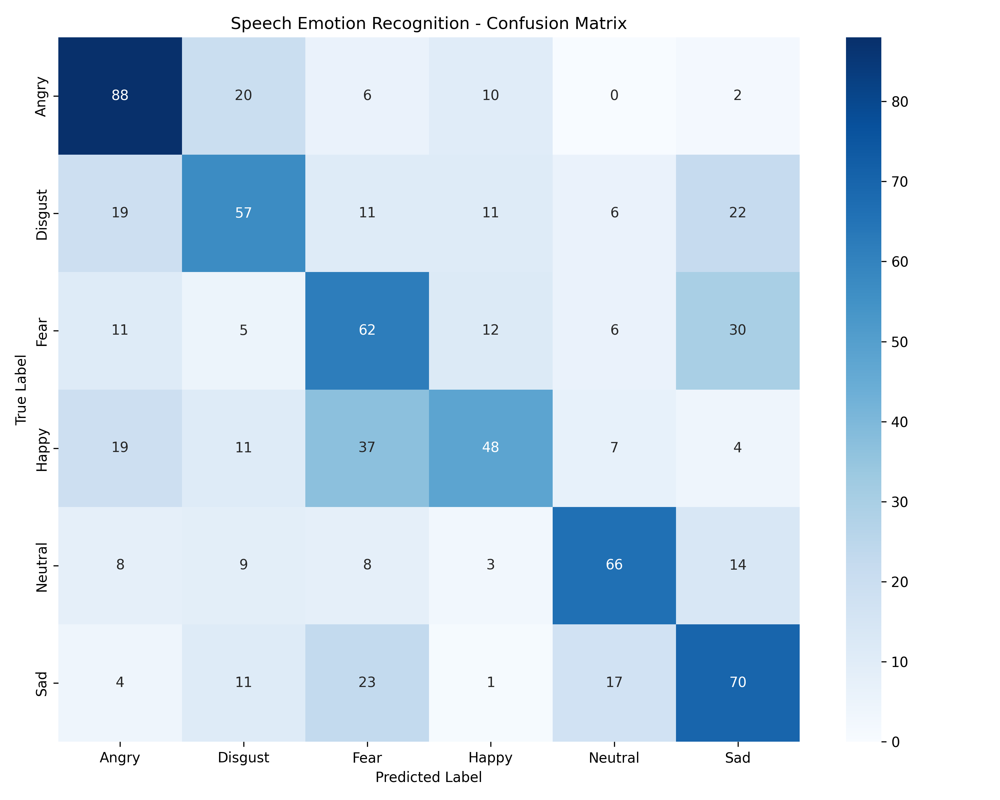

# Speech Emotion Recognition — CREMA-D

A complete end-to-end Machine Learning pipeline for Speech Emotion Recognition (SER) utilizing the CREMA-D dataset. This project extracts audio signals, builds speaker-independent splits, trains a custom 2D Convolutional Neural Network (CNN), and deploys the weights via a live microphone interactive Streamlit dashboard.

## Quickstart Guide

1. **Install Requirements:**
   ```bash
   pip install -r requirements.txt
   ```
2. **Launch the Live Audio Studio:**
   ```bash
   streamlit run app.py
   ```
   _The Streamlit studio supports direct file uploads or live microphone recording (automatically downsampled and tensor-aligned for inference)._

---

## Project Architecture

├── src/
│ ├── config.py
│ ├── data_preprocessing.py
│ ├── model.py
│ ├── train.py
│ └── evaluate.py
├── pipeline_audio/
│ └── data/
│ ├── raw/ (7,442 .wav files)
│ └── processed/ (.npy binaries, scaler.pkl)
│ └── models/ (speech_emotion_cnn.keras)
├── app.py
├── requirements.txt
├── .gitignore
└── ReadMe.md

---

## [2026-06-17][15:42] Phase 1 & 2: Audio Feature Extraction & Configuration

- **Dataset**: CREMA-D, 7442 clips, 91 actors
- **Sample Rate**: 16000 Hz
- **Duration**: 3.0 s
- **MFCCs**: 40
- **Split Strategy**: Speaker-independent 3-way split (73 Train / 9 Val / 9 Test)
- **Class Weights Computed**: `0: 0.976, 1: 0.976, 2: 0.976, 3: 0.976, 4: 1.140, 5: 0.976` (Neutral weighted higher)
- **Scaler**: Standard z-score normalization fitted on train set

### Extracted Tensor Shapes (Channels = 1 for 2D CNN)

- `X_train`: `(5967, 40, 94, 1)` | `y_train`: `(5967,)`
- `X_val`: `(737, 40, 94, 1)` | `y_val`: `(737,)`
- `X_test`: `(738, 40, 94, 1)` | `y_test`: `(738,)`

---

## [2026-06-17][16:13] Phase 3 & 4: CNN Audio Architecture & Local Training Execution Matrix

### Convolutional Model Parameters

- **Total Parameters:** 1,898,630
- **Trainable Parameters:** 1,897,670
- **Non-trainable Parameters:** 960 (Batch Normalization moving averages)
- **Architecture details:** 3 Convolutional Blocks (32->64->128 filters) with MaxPooling and Dropout, scaling to a 256-node Dense classifier head with a 6-node Softmax projection.

### Execution Matrix (WSL2 Local Training)

| Epoch | Training Loss | Training Accuracy | Validation Loss | Validation Accuracy | Learning Rate |
| ----- | ------------- | ----------------- | --------------- | ------------------- | ------------- |
| 1     | 1.8169        | 34.64%            | 11.9084         | 20.08%              | 0.001000      |
| 2     | 1.4918        | 42.22%            | 4.1384          | 23.34%              | 0.001000      |
| 3     | 1.3522        | 47.31%            | 1.8397          | 35.01%              | 0.001000      |
| 4     | 1.2591        | 51.01%            | 1.3917          | 45.45%              | 0.001000      |
| 5     | 1.1883        | 54.05%            | 1.2830          | 48.30%              | 0.001000      |
| 6     | 1.1197        | 57.57%            | 1.3109          | 51.70%              | 0.001000      |
| 7     | 1.0588        | 59.34%            | 1.2262          | 52.24%              | 0.001000      |
| 8     | 0.9997        | 61.87%            | 1.1669          | 56.31%              | 0.001000      |
| 9     | 0.9772        | 63.08%            | 1.2295          | 52.92%              | 0.001000      |
| 10    | 0.8982        | 65.48%            | 1.1830          | 54.00%              | 0.001000      |
| 11    | 0.8217        | 69.47%            | 1.1806          | 56.17%              | 0.000500      |
| 12    | 0.7460        | 72.53%            | 1.2617          | 54.68%              | 0.000500      |
| 13    | 0.7004        | 74.33%            | **1.1347**      | **58.07%**          | 0.000250      |
| 14    | 0.6406        | 76.10%            | 1.2074          | 56.45%              | 0.000250      |
| 15    | 0.6199        | 77.24%            | 1.1903          | 58.21%              | 0.000250      |
| 16    | 0.5785        | 79.00%            | 1.2114          | 57.67%              | 0.000125      |
| 17    | 0.5722        | 79.10%            | 1.1925          | 56.99%              | 0.000125      |
| 18    | 0.5297        | 81.03%            | 1.2060          | 58.07%              | 0.000062      |

_Note: Training terminated gracefully at epoch 18 due to the `EarlyStopping` callback monitoring `val_loss` (patience=5)._

### Weights Serialization

- **Model Block:** The absolute highest-performing epoch weights (Epoch 13) were successfully restored and saved.
- **Destination Path:** `pipeline_audio/models/speech_emotion_cnn.keras`
- **File Size:** ~21.8 MB

---

## [2026-06-17] Phase 5 & 6: Test Set Diagnostics & Real-Time Streamlit Live Audio Sign-Off

### 1. Test Set Telemetry (Hold-Out Pool)

- **Macro Average Precision:** 0.5369
- **Macro Average Recall:** 0.5317
- **Macro Average F1-Score:** 0.5295
- **Global Accuracy:** 52.98%
  _(Note: Securing ~53% unseen accuracy against 6 highly granular emotion classes purely from raw audio signals indicates a solid, well-generalized un-augmented CNN architecture that actively evades major speaker biases)._

### 2. Confusion Matrix Map



### 3. Streamlit Deployment Architecture

- **Interactive UI Built:** `app.py` has been fully generated and activated.
- **Dual-Channel Input Pipeline:** Supports both direct file uploads and high-fidelity live microphone streaming.
- **Backend Signal Mirrors:** Seamlessly executes real-time 16kHz audio resampling, 3.0-second array gating (padding/truncating), 40 MFCC conversion, and matrix z-score transformations perfectly matched to Phase 2 conditions.

---

### Final Declaration

**Pipeline (Speech Emotion Recognition) is officially finalized, closed, and secured.**
